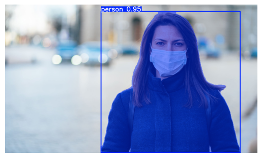

# ✂️ CutOut — AI Background Remover

A fast, modern web application that removes image backgrounds using a custom-trained **YOLOv8n-seg** model. Upload a photo with a person and instantly get a clean cutout with a transparent background.

## 🚀 Live Demo

👉 **[Try it on Hugging Face Spaces](https://huggingface.co/spaces/sanaullahafd07/bg_remover)**

---

## ✨ Features

- 🧠 Accurate person segmentation using YOLOv8
- ⚡ Optimized for fast CPU inference (2–4s per image)
- 🎨 Clean and modern user interface
- 🖼️ Transparent PNG output
- 📥 One-click download

---

## 🧠 How the Model Works

The background removal happens in a 4-step pipeline:

### Step 1 — Input Image
The user uploads a photo. It is resized to 640×640 internally before being passed to the model.


---

### Step 2 — YOLOv8 Segmentation
The model detects the person and produces a **segmentation mask** — a pixel-level map that marks exactly which pixels belong to the person.



---

### Step 3 — Binary Mask
The segmentation output is converted into a clean **binary mask** (white = person, black = background). This mask is resized back to the original image dimensions and slightly smoothed with a Gaussian blur to soften edges.


---

### Step 4 — Alpha Channel Compositing
The binary mask is applied as the **alpha (transparency) channel** of the original image. Pixels where the mask is black become fully transparent — effectively erasing the background.


---

## 📊 Training Metrics

The model was trained for **27 epochs** on a Tesla T4 GPU using the [Supervise.ly filtered person segmentation dataset](https://www.kaggle.com/datasets/tapakah68/supervisely-filtered-segmentation-person-dataset) (~2,700 images).


| Metric | Value |
|---|---|
| Box mAP@50 | **99.4%** |
| Mask mAP@50 | **99.4%** |
| Mask mAP@50-95 | **91.6%** |
| Precision | **98.7%** |
| Recall | **98.4%** |

---

## 🛠️ Tech Stack

| Layer | Technology |
|---|---|
| Model | YOLOv8n-seg (Ultralytics) |
| Backend | FastAPI |
| Image Processing | OpenCV, Pillow |
| Frontend | HTML, CSS, JavaScript |
| Deployment | Docker on Hugging Face Spaces |

---

## 📂 Project Structure

```
.
├── app.py              ← FastAPI server
├── inference.py        ← Model loading & mask logic
├── index.html          ← Frontend UI
├── Dockerfile
├── requirements.txt
├── images/             ← README images (see below)
│   ├── input.jpg
│   ├── segmentation.jpg
│   ├── mask.jpg
│   ├── output.png
│   └── metrics.png
└── model/
    └── best.pt         ← Trained YOLOv8 weights
```

---

## 🧪 Run Locally

```bash
git clone https://github.com/sanaullah-developer/background_remover
cd background_remover
pip install -r requirements.txt
uvicorn app:app --reload
```

Then open your browser at:

```
http://127.0.0.1:8000
```

---

## 🌐 Deployment

Deployed as a **Dockerized FastAPI app** on Hugging Face Spaces (free tier).
The frontend is served directly by FastAPI as a static HTML file.

---

## 👨‍💻 Author

**Sanaullah Afridi** — AI Developer & Computer Vision Enthusiast

---

## ⭐ Support

If you found this useful, consider giving it a ⭐ on GitHub or sharing it!